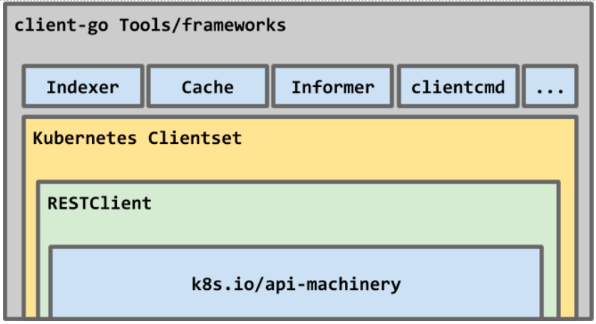

# Kubernetes-Client-Cookbook

Kubernetes 使用 [client-go](https://github.com/kubernetes/client-go) 作为 Golang 语言的官方编程式交互客户端库，提供对 Kubernetes API Server 服务的交互式访问。

## 源码结构

其源码目录结构如下：

|目录|描述|
|---|---|
|applyconfigurations|
|discovery| 提供 DiscoveryClient 发现客户端
|dynamic| 提供 DynamicClient 动态客户端
|examples| 各种使用示例
|informers| 每种 K8S 资源的 Informer 实现
|kubernetes| 提供 ClientSet 客户端
|listers| 为每一个 K8S 资源提供 Lister 功能，该功能对 Get 和 List 请求提供只读的缓存数据
|metadata|
|openapi|
|pkg|
|plugin| 提供 OpenStack，GCP 和 Azure 等云服务商授权插件
|rest| 提供 RESTClient 客户端，对 K8S API Server 执行 RESTful 操作
|restmapper|
|scale|提供 ScaleClient 客户端，用于扩容或缩容 Deployment, Replicaset, Replication Controller 等资源对象
|testing|测试
|third_party|
|tools| 提供常用工具，例如 SharedInformer, Reflector, DeltaFIFO 及 Indexers，提供 Client 查询和缓存机制，以减少向 kube-apiserver 发起的请求数等，主要子目录为 `/tools/cache`
|transport| 提供安全的 TCP 连接，支持 HTTP Stream，某些操作需要在客户端和容器之间传输二进制流，例如 exec，- attach 等操作，该功能由内部的 SPDY 包提供支持
|util| 提供常用方法，例如 WorkQueue 工作队列，Certificate 证书管理等
