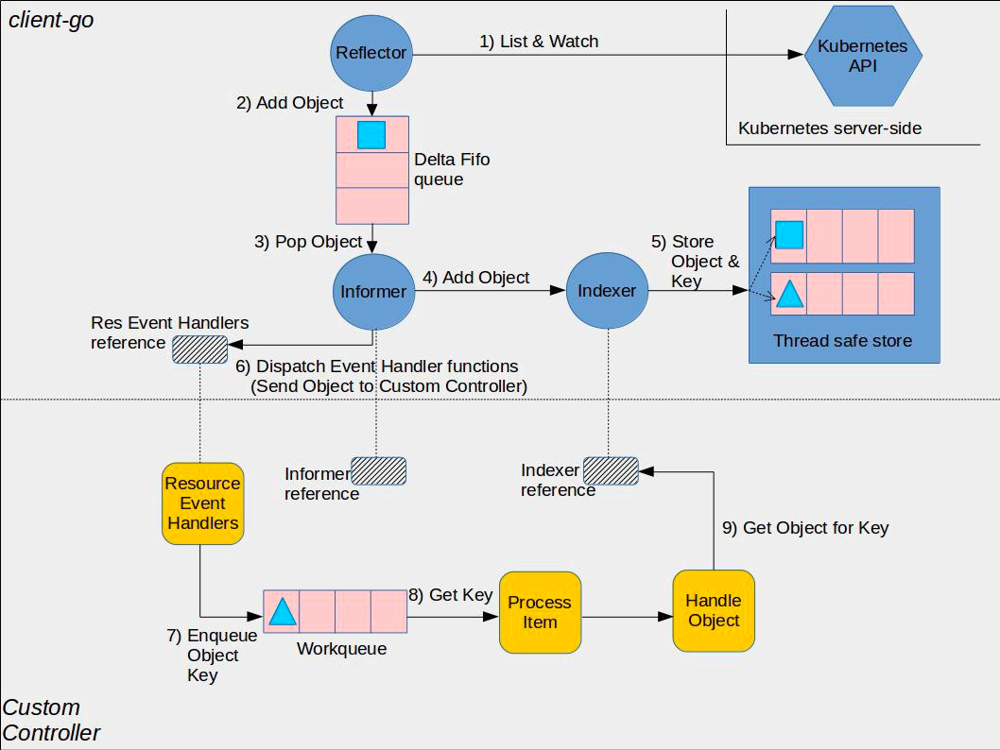

# Informer

通过 Informer 机制获取数据的情况下，在初始化的时候会从 Kubernetes API Server 获取对应 Resource 的全部 Object，后续只会通过 Watch 机制接收 API Server 推送过来的数据，不会再主动从 API Server 拉取数据，直接使用本地缓存中的数据以减少 API Server 的压力。

## 优点

1. Watch 机制基于 HTTP 的 Chunk 实现，维护一个长连接，减少请求的数据量。
2. SharedInformer 可以让同一种资源使用的是同一个 Informer，例如 v1 和 v1beta1 版本的 Deployment同时存在的时候，共享一个 Informer。

图中可以看到 Informer 分为三个部分，可以理解为三大逻辑。

- Reflector 主要是把从 API Server 获取到的数据放到 DeltaFIFO 队列中，充当生产者角色。
- SharedInformer 主要是从 DeltaFIFIO 队列中获取并分发数据，充当消费者角色。
- Indexer 作为本地缓存的存储组件。

Reflector 主要看 Run、ListAndWatch、watchHandler 三个地方，数据的生产就2点：

1. 初始化时从 API Server 请求数据
2. 监听后续从 Watch 推送来的数据

List/Watch：List 是列举 apiserver 中对象的接口，Watch 是监控 apiserver 资源变化的接口；

Reflector：实现对 apiserver 指定类型对象的监控，其中反射实现的就是把监控的结果实例化成具体的对象；

DeltaIFIFO：将 Reflector 监控的变化的对象形成一个 FIFO 队列，此处的 Delta 就是变化，DeltaFIFO；

LocalStore：指的就是 Indexer 的实现 cache，这里面缓存的就是 apiserver 中的对象(其中有一部分可能还在 DeltaFIFO中)，此时使用者再查询对象的时候就直接从 cache 中查找，减少了 apiserver 的压力；

Callbacks：通知回调函数，Informer 感知的所有对象变化都是通过回调函数通知使用者(Listener)；
